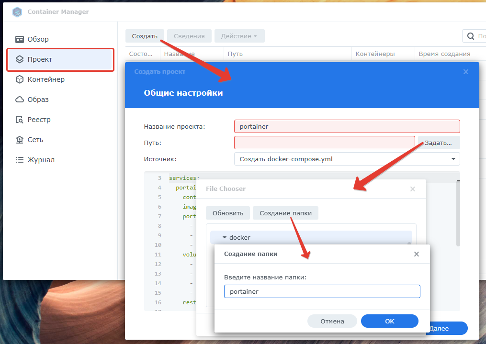
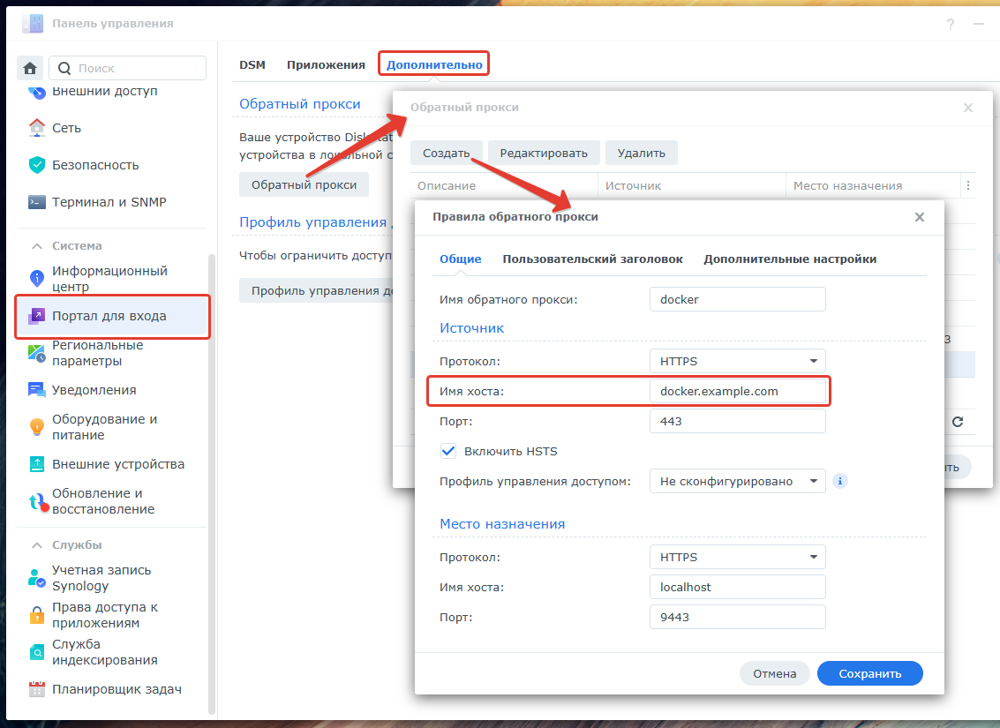
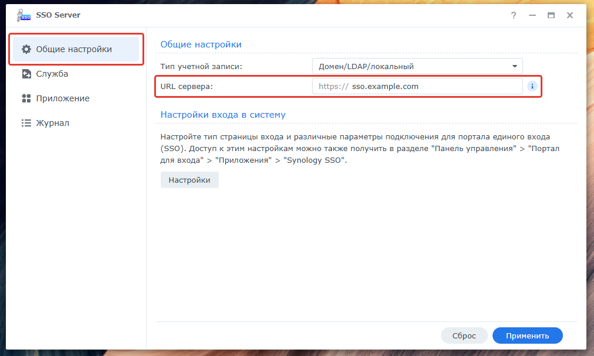
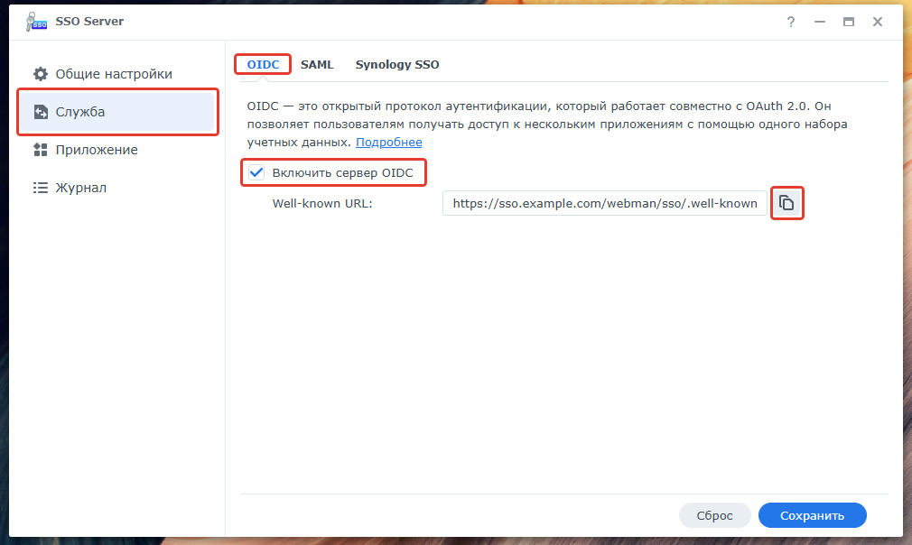
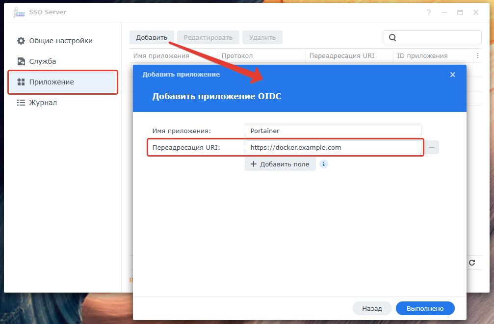
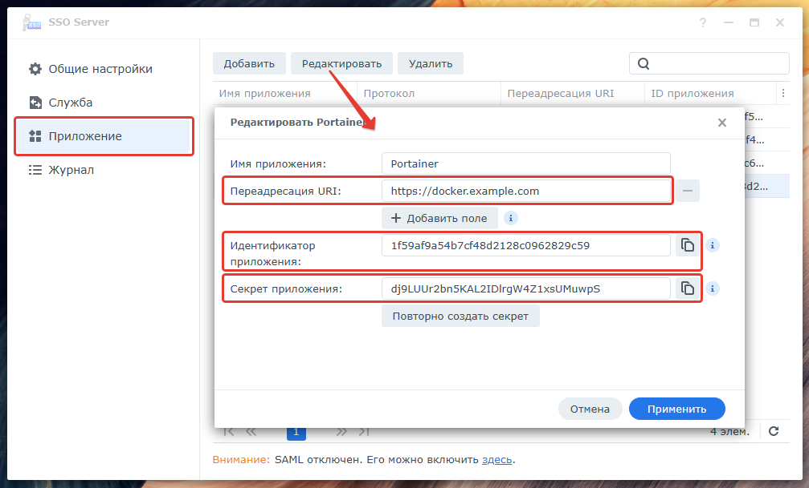
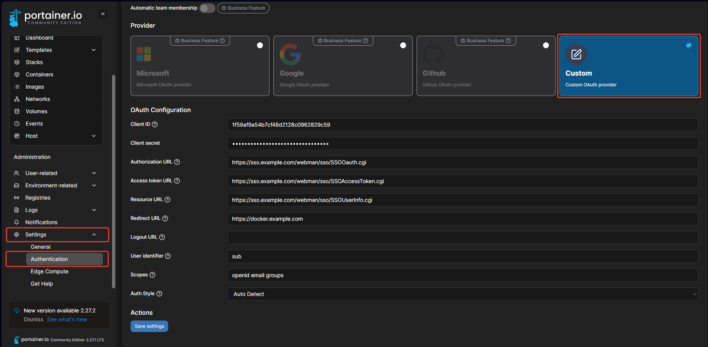
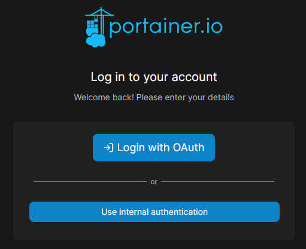

# portainer

Данный проект, собственно, и не проект вовсе, а описание запуска Portainer в докере на Synology DSM 7, а также входа в него по SSO (Single Sign-On)

## Начнём

Инструкции ниже помогут вам запустить Portainer в докере на Synology DSM 7, а также, если необходимо, настроить вход в Portainer по SSO.

> [!NOTE]
> Где необходимо, иструкции снабжены скриншотами, ищите их под описанными действиями

### Необходимые условия

- Synology DSM 7.x
- Установленный пакет Container Manager
- Установленный пакет SSO Server (если требуется SSO)

### Установка Portainer на Synology DSM 7.x

- В `Container Manager` создайте проект `portainer`, укажите вновь созданную папку `docker/portainer` и скопируйте в окно содержимое файла [compose.yaml](compose.yaml)
    <details>
        <summary>Скриншот</summary>
        
    
    </details>
- Пройдите мастер до конца (флаг запуска проекта после создания оставить взведённым), контейнер запустится, вот и вся установка 😉…
- Интерфейс Portainer теперь доступен в вашей локальной сети через браузер по вашему IP-адресу NAS, например, `http://192.168.1.234:9000`, неплохая инструкция по настройке от WunderTech - [тынц](https://www.portainer.io/blog/how-to-install-portainer-on-a-synology-nas)
- При желании можно вывести интерфейс Portainer через обратный прокси в инеты, например, на `https://docker.example.com`
    <details>
        <summary>Скриншот</summary>
        
    
    </details>

> [!IMPORTANT]
> При создании пользователя администратора желательно дать ему имя, совпадающее с существующим именем (я и пароль такой же сделал, чтоб не путаться) в Synology DSM, это не обязательно, но ускоряет процесс настройки входа в Portainer через SSO

### Настройка SSO Server

- В `SSO Server` необходимо настроить параметры на трёх вкладках (я буду отмечать цифрами параметры, которые необходимы для настройки SSO для Portainer):
    - Общие настройки:
        - Тип учётной записи: **`Домен/LDAP/локальный`** или `Домен/LDAP` (я выбрал первый, т.к. доступ в Portainer планирую давать как локальным пользователям, так и пользователям LDAP (требуется пакет `LDAP Server`))
        - URL сервера: это ваш базовый адрес SSO-сервера, который в дальнейшем будет использоваться для авторизации, например, `https://sso.example.com`
        - Настройки входа в систему - это настройка вида портала, настраивается как и любой другой портал на Synology DSM из Панели управления
        <details>
            <summary>Скриншот</summary>
            
        
        </details>
    - Служба:
        - OIDC (другие не требуются):
            - Включить сервис: ☑️ (флаг взведён)
            - `Well-known URL`: ссылка вида `https://sso.example.com/webman/sso/.well-known/openid-configuration`, здесь доступна кнопка копирования адреса в буфер
            <details>
                <summary>Скриншот</summary>
                
            
            </details>
    - Приложение:
        - `Добавить` -> `OIDC` -> Имя приложения: `Portainer`, `Переадресация URL`: `https://docker.example.com` 6️⃣ (ссылка на Portainer web-интерфейс)
            <details>
                <summary>Скриншот</summary>
                
            
            </details>
        - `Редактировать`: здесь можно найти `Идентификатор приложения` 1️⃣ и `Секрет приложения` 2️⃣
            <details>
                <summary>Скриншот</summary>
                
            
            </details>

### Настройка SSO в Portainer

- На этапе первоначальной настройки Portainer мы создали пользователя администратора, имя которого сопадает с одним из пользователей администраторов в Synology. Если это не так, то самое время создать в Portainer такого пользователя
- В браузере введите адрес URL, скопировав из настроек `SSO Server` -> `Служба` -> `OIDC` -> `Well-known URL` -> кнопка копирования URL, получите `json` примерно такого содержания:
    <details>
        <summary>json</summary>

    ```json
    {
        "authorization_endpoint" : "https://sso.example.com/webman/sso/SSOOauth.cgi", 3️⃣
        "claims_supported" : [ "aud", "email", "exp", "groups", "iat", "iss", "sub", "username" ], 7️⃣
        "code_challenge_methods_supported" : [ "S256", "plain" ],
        "grant_types_supported" : [ "authorization_code", "implicit" ],
        "id_token_signing_alg_values_supported" : [ "RS256" ],
        "issuer" : "https://sso.example.com/webman/sso",
        "jwks_uri" : "https://sso.example.com/webman/sso/openid-jwks.json",
        "response_types_supported" : [ "code", "code id_token", "id_token", "id_token token" ],
        "scopes_supported" : [ "email", "groups", "openid" ], 8️⃣
        "subject_types_supported" : [ "public" ],
        "token_endpoint" : "https://sso.example.com/webman/sso/SSOAccessToken.cgi", 4️⃣
        "token_endpoint_auth_methods_supported" : [ "client_secret_basic", "client_secret_post" ],
        "userinfo_endpoint" : "https://sso.example.com/webman/sso/SSOUserInfo.cgi" 5️⃣
    }
    ```
    </details>
- Теперь в веб-интерфейсе Portainer, слева в меню выберите `Settings` -> `Authentication` -> `OAuth`, включите `Use SSO` и в разделе `Provider` выберите `Custom` и заполните поля (цифры соответствуют параметрам, полученным/настроенным ранее):
    - Client ID: 1️⃣ (`SSO Server` -> `Приложение` -> `Portainer` -> `Идентификатор приложения`)
    - Client secret: 2️⃣ (`SSO Server` -> `Приложение` -> `Portainer` -> `Секрет приложения`)
    - Authorization URL: 3️⃣ (json `authorization_endpoint`)
    - Access token URL: 4️⃣ (json `token_endpoint`)
    - Resource URL: 5️⃣ (json `userinfo_endpoint`)
    - Redirect URL: 6️⃣ (`SSO Server` -> `Приложение` -> `Portainer` -> `Переадресация URL`)
    - Logout URL: (оставляем пустым, видимо, не поддерживается сервером)
    - User identifier: `sub` (json `claims_supported`, идентификатор пользователя, выбирается уникальным из 7️⃣)
    - Scopes: `openid email groups` (json `scopes_supported`, выбираем из 8️⃣)
    - Auth Style: `Auto Detect` (не трогаем)
    <details>
        <summary>Скриншот</summary>
        
    
    </details>
- Сохраните настройки, теперь попробуйте залогиниться, - сначала Portainer перебросит вас на сервер SSO, если не открыто никаких сессий DSM, а впоследствии будет автоматически заходить под активным DSM-пользователем (только если логиниться через SSO). Если же вам требуется зайти под другим пользователем, используйте режим `Use internal authentication`
    <details>
        <summary>Скриншот</summary>
        
    
    </details>

## Технологии

- [Synology](https://www.synologuy.com/)    
- [Docker](https://www.docker.com/)
- [Portainer](https://www.portainer.io/)
- [OIDC](https://openidconnect.net/)

## Вклад

- Предложения и замечания категорически приветствуются [здесь](https://github.com/arabezar/portainer/discussions)
